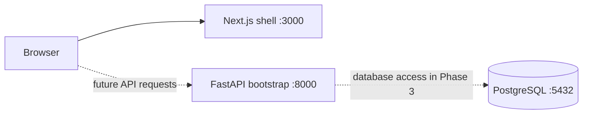
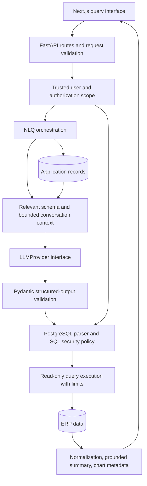

# Architecture

## Phase 1 implementation

The monorepo has independently runnable frontend and backend applications. npm workspaces
manage the frontend; uv manages Python. Docker Compose provides development processes and one
PostgreSQL instance. The browser reaches FastAPI through a configured public API URL, and CORS
uses explicit origins. Phase 2 adds the database schema and maintenance commands. Phase 3 adds
isolated runtime database engines and health endpoints.

Phase 1 includes:

- Next.js 16, React 19, strict TypeScript, Tailwind 4, shadcn/ui configuration, and Lucide icons.
- A responsive application shell without business data or query execution.
- FastAPI application construction, Pydantic Settings validation, and development OpenAPI docs.
- Independent lint, typecheck, build, and backend bootstrap/configuration checks.
- Explicit dependency locks, environment templates, and local secret generation.
- Development Dockerfiles, reload mounts, startup checks, and a persistent PostgreSQL volume.

## Phase 2 implementation

SQLAlchemy metadata and an immutable Alembic revision define 12 ERP tables and three application
metadata tables. Separate administrator, migrator, application, and reader credentials keep
maintenance operations outside the running API. Explicit Compose task profiles run configuration,
role provisioning, migration, and sample-data loading.

All ERP relationships include tenant identity. Reader RLS resolves a tenant through a protected
database-login mapping using `session_user`. Changing a custom session setting cannot change the
tenant. The initial reader login belongs to one tenant; future multi-tenant query connections
must preserve this login-to-tenant boundary rather than reuse a single global reader login.

Deterministic seeds create two synthetic tenants, exact decimal monetary values, historical
orders, invoices, payments, and inventory snapshots. Seed markers and an advisory transaction
lock make loading atomic and repeatable. See [database design and operations](database.md).

Business routes, authentication, providers, charts, query history, saved queries, and Redis are
introduced in subsequent phases.

## Phase 3 implementation

FastAPI creates two independent SQLAlchemy engine pools during its lifespan: `DATABASE_URL` must
authenticate as `nlq_app`; `ANALYTICS_DATABASE_URL` must authenticate as `nlq_reader`. Neither
accepts migration or bootstrap identities. Application and analytics session dependencies are
provided for later repositories/services, but no business route can access data yet.

`GET /api/v1/health/live` checks only API process liveness. `GET /api/v1/health/ready` tests each
runtime identity and verifies that the analytics role defaults to a read-only transaction. It
returns only `ok`, `unconfigured`, or `unavailable` status for each path—never connection strings,
credentials, or database exceptions. Liveness remains available if runtime URLs are absent or
malformed so operational diagnosis does not depend on database availability.

In Docker Compose, URL credentials remain in `apps/api/.env`, while container-only host/port
overrides route both runtime pools to the `postgres` service. The API never receives bootstrap or
migration credentials. The Compose health check uses liveness, leaving readiness meaningful for
deployments that require the database.

## Target request flow

FastAPI remains a modular monolith. Routes handle HTTP concerns; services orchestrate business
behavior; repositories and dedicated execution services access persistence. Provider adapters
implement one typed interface. The model proposes SQL and chart metadata but has no execution
capability or authority to choose a user's permissions.

## Persistence boundary

Use one PostgreSQL database initially with separate `app` and `erp` schemas. Phase 2 implements
explicit roles and grants; Phase 3 adds separate SQLAlchemy runtime engines. The existing Compose
`POSTGRES_USER` is a bootstrap administrator and must never become an API connection identity.

| Identity | Intended access |
| --- | --- |
| `nlq_app` | Application records only; controlled reads and writes |
| `nlq_reader` | SELECT on approved ERP relations; no application records |
| `nlq_migrator` | Controlled migrations; unavailable to API runtime |

`DATABASE_URL` and `ANALYTICS_DATABASE_URL` remain distinct settings. The migration
environment holds `MIGRATION_DATABASE_URL` separately. The API's environment does not contain
bootstrap or migration credentials. Schema ownership, tenant scope, grants, and indexes are
designed with Phase 2 rather than retrofitted after query execution exists.

## NLQ safety boundary

Phase 4 must enforce authorization and SQL policy before execution, even though interactive
authentication is scheduled for Phase 7. Pre-auth operation is local development only.

SQL validation will parse PostgreSQL syntax and inspect all statements and nested expressions.
It must reject modifying CTEs, SELECT INTO, unauthorized relations, unsafe functions, and any
unsupported construct. Read-only privileges and transactions supplement this policy; neither
SELECT syntax nor a read-only transaction is a complete SQL sandbox.

Query timeout, returned-row count, response size, and pagination are independent controls.
Schema and result caches must include authorization scope. Conversation context must be bounded.
Tenant isolation and history/saved-query ownership are enforced by the backend, never by a prompt.

## Development container design

PostgreSQL, API, and frontend readiness are checked independently. The API liveness probe checks
`/api/v1/health/live`; it proves the process is available without making deployment health depend
on database configuration. `/api/v1/health/ready` separately tests both restricted database
identities. Compose waits for PostgreSQL before starting the API, then for API liveness before the
frontend.

The PostgreSQL 18 image stores data beneath `/var/lib/postgresql/18/docker`, so its persistent
volume is mounted at `/var/lib/postgresql`. API dependencies live in `/opt/venv`; host source
mounts cannot hide them. Frontend host dependencies and `.next` output are masked with named
volumes to keep Windows artifacts out of the Linux runtime.

The API and web containers receive only their respective environment files. Docker build
contexts exclude environment files, local tools, editor worktrees, and generated dependencies.
All published ports bind to loopback. Images use explicit versions; base runtime and PostgreSQL
images also pin registry digests. These are development containers, with production images,
deployment secrets, monitoring, and operational controls scheduled for Phase 8.

## References

- [Next.js 16 requirements and separate linting](https://nextjs.org/docs/app/guides/upgrading/version-16)
- [shadcn/ui installation for Next.js](https://ui.shadcn.com/docs/installation/next)
- [Next.js public environment variables](https://nextjs.org/docs/app/guides/environment-variables)
- [Compose readiness and startup ordering](https://docs.docker.com/compose/how-tos/startup-order/)
- [PostgreSQL image configuration and version 18 data directory](https://hub.docker.com/_/postgres)
- [uv Docker integration](https://docs.astral.sh/uv/guides/integration/docker/)
