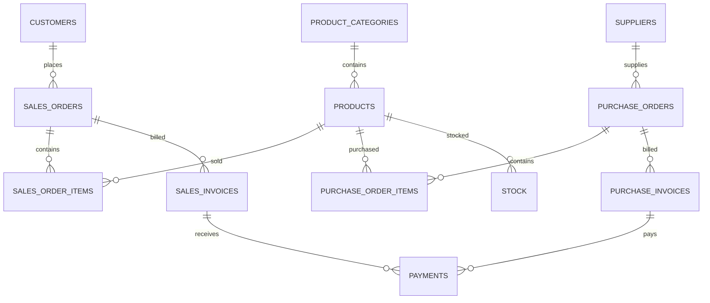

# Database foundation

Phase 2 uses PostgreSQL 18, SQLAlchemy 2, Psycopg 3, and Alembic. Phase 3 adds isolated runtime
connection pools for the application and analytics roles. Business data routes arrive later.

## Set up the database

For Docker Desktop with Linux containers and Compose 2.24 or newer, run from the repository root:

```powershell
.\scripts\setup.ps1
docker compose --profile database run --build --rm db-configure
docker compose --profile database run --build --rm db-bootstrap
docker compose --profile database run --build --rm migrate
docker compose --profile database run --build --rm seed
docker compose --profile database run --rm migrate uv run --frozen alembic check
```

The first command preserves existing configuration. `db-configure` fills empty role credentials
with cryptographically random values and writes URL-encoded connection strings. Existing
nonempty values are preserved; deliberate connection changes must be made in the relevant files.
The task mounts the repository at `/workspace` only for writing local configuration.

Database tasks use separate environment scopes:

| Command | Credential source | Access |
| --- | --- | --- |
| `app.db.bootstrap` | Root `.env`, `POSTGRES_*` and `NLQ_*_PASSWORD` | Administrator provisioning |
| `alembic` | `apps/api/migrations/.env`, `MIGRATION_DATABASE_URL` | Schema owner/migrator |
| `python -m seeds` | Same migration environment | Development/test sample loading |
| API application runtime | `apps/api/.env`, `DATABASE_URL` | Application role; routes arrive later |
| API analytics runtime | `apps/api/.env`, `ANALYTICS_DATABASE_URL` | Restricted reader; NLQ execution is Phase 4 |

Compose overrides `MIGRATION_DATABASE_HOST=postgres` and `MIGRATION_DATABASE_PORT=5432` while
preserving the encoded credentials. Native commands use the host URL in `migrations/.env`.
The API never receives bootstrap or migration credentials. Native API runtime URLs are loaded
from `apps/api/.env`; Compose changes only their host and port to its private `postgres` service.

The API owns two pool-backed engines. Its application session dependency uses `nlq_app`; its
analytics session dependency uses `nlq_reader`. Route handlers must obtain these dependencies
rather than constructing engines or accepting connection URLs. Neither dependency executes user-
generated SQL; that execution path remains Phase 4 work.

`GET /api/v1/health/live` returns `200` when FastAPI is running. `GET /api/v1/health/ready`
checks both runtime roles with a minimal database statement and confirms the analytics role's
default transaction is read-only. Readiness returns `503` with safe `unconfigured` or
`unavailable` check statuses when either path is unavailable; it does not expose database errors
or credentials.

For a native PostgreSQL 18 server, create an empty `nlq` database under your administrator first
and set the root `.env` to match its host, port, database, username, and password. Then run from
`apps/api`:

```powershell
uv sync --frozen
uv run --frozen python -m app.db.configure
uv run --frozen python -m app.db.bootstrap
uv run --frozen alembic upgrade head
uv run --frozen python -m seeds
uv run --frozen alembic check
```

The configure command is for loopback development databases. Provisioning checks existing role
attributes, memberships, object ownership, and table grants. Unexpected privileged identities or
access fail closed rather than taking over existing database objects. Repeated provisioning of a
valid setup preserves data and reapplies the required role settings.

## Schema and relationships

Every ERP row has a UUID, `tenant_id`, `created_at`, and `updated_at`. Timestamps include timezone;
the database session default is UTC. PostgreSQL triggers maintain update timestamps for direct
SQL writes as well as ORM writes.



The diagram shows business links. Each foreign key between ERP tables also includes `tenant_id`,
so an order cannot reference a customer, supplier, product, or invoice from another tenant.

| Table | Key business fields and rules |
| --- | --- |
| `customers`, `suppliers` | Tenant-unique codes; synthetic contact/location data |
| `product_categories` | Tenant-unique category names |
| `products` | Tenant-unique SKU, category, INR prices, global product reorder level |
| `purchase_orders` | Supplier, order number/date, expected date, status, totals |
| `sales_orders` | Customer, order number/date, delivery date, status, totals |
| Order item tables | Order/product, positive quantity, price, tax rate, generated line amounts |
| Invoice tables | Order, invoice number/date, due date, status, totals |
| `payments` | Exactly one purchase or sales invoice; positive amount, date, method |
| `stock` | One row per tenant/product/warehouse; reserved quantity cannot exceed quantity |

`app.tenants` identifies organizations. `app.analytics_principals` maps a database login to one
authorized tenant. `app.seed_runs` records completed fixture versions. Alembic maintains its
own `app.alembic_version` table.

Money uses `NUMERIC`, with two decimal places. Quantities also support two decimal places.
Line subtotal, tax, and total are PostgreSQL-generated stored values; tax rates are percentages
such as `18.00`. Header checks enforce subtotal plus tax equals total. Header totals are
snapshots, and cross-row reconciliation is verified for the seed data; future ERP write/import
services must maintain these aggregates transactionally.

Invoice customer/supplier identity is derived through its order. A sales-invoice payment is
incoming; a purchase-invoice payment is outgoing. This avoids independently editable party or
direction fields that could disagree. Indexes cover tenant-scoped joins, document numbers,
dates, statuses, category lookups, and inventory locations.

## Reader boundary

`nlq_migrator` owns `app` and `erp` and is trusted to change schema/data. It has no superuser,
database-creation, role-creation, replication, or RLS-bypass attributes. As table owner, it can
perform migrations and seed operations outside reader policies.

`nlq_reader` has SELECT on the twelve approved ERP tables and no access to application records.
Every ERP table has a SELECT policy calling `erp.authorized_tenant_id()`. That function has a
fixed `pg_catalog` search path, reads the protected mapping, and uses the original login
`session_user`. A reader cannot change tenants by setting a custom GUC or switching to the
migration role. An unmapped login has no tenant access.

`nlq_app` has usage of `app`, SELECT on the tenant registry, and controlled CRUD grants on the
Phase 7 `users`, `conversations`, `query_records`, `saved_queries`, and `user_settings` tables.
`nlq_reader` has no grants on these application records. The application role cannot read ERP tables. Runtime roles
cannot create schemas or temporary objects. Reader sessions default to read-only transactions,
a 10-second statement timeout, a 1-second lock timeout, and a 10-second idle transaction timeout.
Privileges still deny writes if a caller turns off the session read-only setting.

This is a database boundary, not the complete future SQL validator. Phase 4 must still enforce
parser rules, safe functions, authorized schema selection, row/response limits, and trusted
user-to-connection routing. Each reader login is assigned one tenant; a future application must
not route all SaaS tenants through the single development reader credential.

## Sample data

Fixtures are deterministic, use fixed UUIDs and decimal calculations, and are wholly synthetic.
Emails use `example.invalid`. The reference date is **2026-09-30**, with transactions spanning
January 2025 through September 2026. Use this date for reproducible inactivity/overdue examples.

| Records | Deccan demo | Konkan demo |
| --- | ---: | ---: |
| Customers | 60 | 8 |
| Suppliers | 20 | 4 |
| Categories | 8 | 4 |
| Products | 80 | 12 |
| Purchase orders / lines | 300 / 1,040 | 24 / 91 |
| Sales orders / lines | 600 / 2,111 | 48 / 160 |
| Purchase invoices | 229 | 18 |
| Sales invoices | 458 | 37 |
| Payments | 687 | 57 |
| Stock locations | 160 | 24 |

The development reader maps to Deccan. Konkan remains hidden to that login and provides a real
isolation test. Confirmed purchase orders are pending receipt; received orders are completed.
For sales-order analytics, confirmed/shipped/delivered orders are active, while draft/cancelled
orders are excluded. Sales-order value and invoice collections are separate metrics.

Stock is an as-of snapshot across two warehouses, with available quantity equal to quantity
minus reserved quantity. Product reorder checks compare the sum of available stock against the
product's reorder level. An inventory movement ledger is outside this milestone.

The loader acquires an advisory transaction lock, inserts both tenants and their seed markers
atomically, and skips an already committed seed version. Conflicting existing tenant records or
reader assignments cause a rollback. There is no reset/truncate option. The sample CLI accepts
only `APP_ENV=development` or `test` from the migration environment.

## Verification and migration workflow

Run `uv run --frozen pytest` from `apps/api` for unit checks. PostgreSQL tests require explicit
test credentials; they skip without them. Provision a separate database named `nlq_test*`, apply
the same bootstrap/migration/seed commands targeting that database, and supply:

```text
TEST_DATABASE_URL           = nlq_migrator connection to the isolated test database
TEST_READER_DATABASE_URL    = nlq_reader connection to that same database
TEST_APP_DATABASE_URL       = nlq_app connection to that same database
TEST_ADMIN_DATABASE_URL     = optional nlq_bootstrap connection for provisioning tests
```

Use a separate PostgreSQL instance for testing so cluster-wide role settings and credentials do
not interfere with development. Tests verify actual PostgreSQL constraints, generated monetary
values, same-tenant relationships, row visibility, denied role escalation/writes, reconciliation,
and seed repeatability. Integration mutations are rolled back.

`alembic check` compares metadata to the migrated database. Review every new revision before
applying it. The first revision also manages RLS policies, privileges, and timestamp triggers;
these require explicit migration review because Alembic autogeneration does not track them.
An offline script can be reviewed with `alembic upgrade head --sql` using migration configuration.

The initial downgrade removes the ERP and provisioning tables and their data. Rollback/re-apply
verification belongs on disposable test databases. It preserves the bootstrap-created schemas
and Alembic's version table so a subsequent upgrade can run.

## Workspace identity and query records

Revision `0002_workspace_identity` stores Argon2 password hashes in `app.users`, never plaintext
credentials. A user owns conversations, query records, saved query snapshots, and one settings row.
Every history and saved-query lookup includes the authenticated user ID; ownership is enforced by
the API query predicate, rather than by a browser-supplied user identifier. Query records preserve
the bounded result returned to the user, including columns, rows, SQL, summary, and visualization.

The application API uses `nlq_app` only for this workspace data. Generated SQL remains exclusively
on the distinct `nlq_reader` connection and ERP RLS policy. Apply the migration before using the
login flow, then create a user with `python -m app.auth.create_user --email ... --tenant deccan-demo`.
